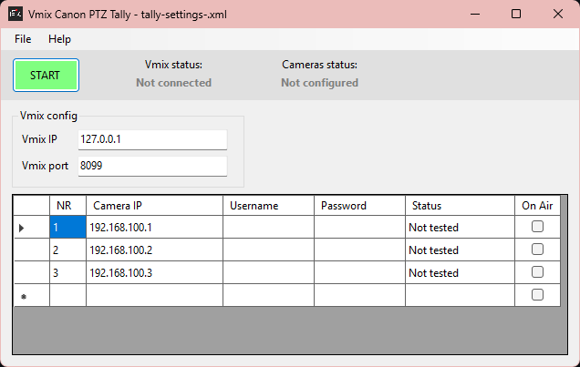

# vMix Canon PTZ Tally


A Windows application that integrates vMix video production software with Canon PTZ cameras to provide **automated tally light control**. When an input becomes active in vMix, the corresponding camera's tally light automatically turns on, providing clear visual feedback to camera operators. 

Meant for Canon PTZ Cameras like CR-N300, CR-N500, CR-N700. 




[](https://dotnet.microsoft.com/)
[](https://www.microsoft.com/windows)
[](LICENSE)


## Features

- **Real-time Tally Control**: Automatically controls Canon PTZ camera tally lights based on vMix active inputs
- **vMix Integration**: Connects to vMix TCP API for live tally status updates
- **Multiple Camera Support**: Manage and control multiple Canon PTZ cameras simultaneously
- **Visual Feedback**: Real-time connection status and tally state indication in the UI
- **System Tray Integration**: Minimize to system tray for unobtrusive operation during production
- **Camera Testing**: Built-in connection testing for both vMix and individual cameras
- **Settings Management**: Save and load camera configurations with recent files support
- **Automatic Reconnection**: Auto-retry connection to vMix if connection is lost
- **Authentication Support**: Optional HTTP Basic Authentication for camera control

## Requirements

- **Operating System**: Windows (Windows 10 or later recommended)
- **Runtime**: .NET 8.0 Runtime
- **vMix**: vMix software running with TCP API enabled (default port 8099)
- **Cameras**: Canon PTZ cameras with HTTP API support

## Installation

1. Download the latest installer from the [Releases](../../releases) page
2. Run the installer and follow the setup wizard
3. Launch the application from the Start Menu or desktop shortcut

## Quick Start

1. **Configure vMix Connection**
   - Enter your vMix IP address (default: `127.0.0.1`)
   - Enter vMix TCP port (default: `8099`)
   - Click "Test Connection" to verify connectivity

2. **Add Cameras**
   - Enter camera details in the grid:
     - **Camera Number**: Corresponding vMix input number (1-based)
     - **IP Address**: Camera's network IP address
     - **Username/Password**: Optional authentication credentials

3. **Start Tally System**
   - Click "Start" to begin monitoring vMix and controlling tally lights
   - **Camera tally lights will automatically respond to vMix input changes!**

4. **Save Configuration**
   - Use File > Save or Save As to save your camera configuration
   - The application will automatically reload your last configuration on startup

## How It Works

### Communication Flow

```
vMix → TCP Connection → Application → HTTP API → Canon PTZ Cameras
```

1. **vMix TCP Connection**: The application subscribes to vMix's TALLY events via TCP API
2. **Tally Processing**: Parses tally status strings to identify active (program) inputs
3. **Camera Control**: Sends HTTP commands to Canon cameras to turn tally lights on/off
   - **Program (On-Air)**: Red tally light
   - **Off**: Tally light turns off

### vMix Input Mapping

Each camera is mapped to a vMix input number:
- Camera Number `1` = vMix Input 1
- Camera Number `2` = vMix Input 2
- And so on...

When a vMix input becomes active (program), the corresponding camera's tally light turns red.

## Configuration

### Settings File Format

Configuration files are stored as XML and contain:
- vMix connection settings (IP address and port)
- Camera configurations (number, IP, credentials)

### Canon Camera API

The application uses Canon's HTTP control API:
- **Endpoint**: `http://{camera-ip}/-wvhttp-01-/control.cgi`
- **Tally ON**: `?tally=on&tally.mode=program`
- **Tally OFF**: `?tally=off`
- **Authentication**: HTTP Basic Authentication (optional)

## Building the Project

### Prerequisites
- Visual Studio 2022 or later
- .NET 8.0 SDK

## Troubleshooting

### vMix Connection Issues
- Verify vMix is running and TCP API is enabled
- Check that the IP address and port are correct (default: `127.0.0.1:8099`)
- Ensure no firewall is blocking the connection
- Use "Test Connection" button to diagnose

### Camera Connection Issues
- Verify camera IP addresses are correct and cameras are on the network
- Test camera HTTP API access from a web browser: `http://{camera-ip}/-wvhttp-01-/control.cgi?tally=off`
- Check if authentication is required and credentials are correct
- Ensure cameras are Canon PTZ models with HTTP API support

### Tally Lights Not Responding
- Verify the camera number matches the vMix input number
- Check that the vMix input is actually in program (not preview)
- Ensure the tally system is started (status shows "Running")
- Review the status messages in the application for errors

## Contributing

> Contributions are welcome! Please feel free to submit a Pull Request.

## License

This project is licensed under the MIT License - see the [LICENSE](LICENSE) file for details.

## Acknowledgments

- Built for use with [vMix](https://www.vmix.com/) video production software
- Designed for Canon PTZ cameras with HTTP API support

## Support

For issues, questions, or suggestions, please [open an issue](../../issues) on GitHub.

---

Made with passion for live video production
